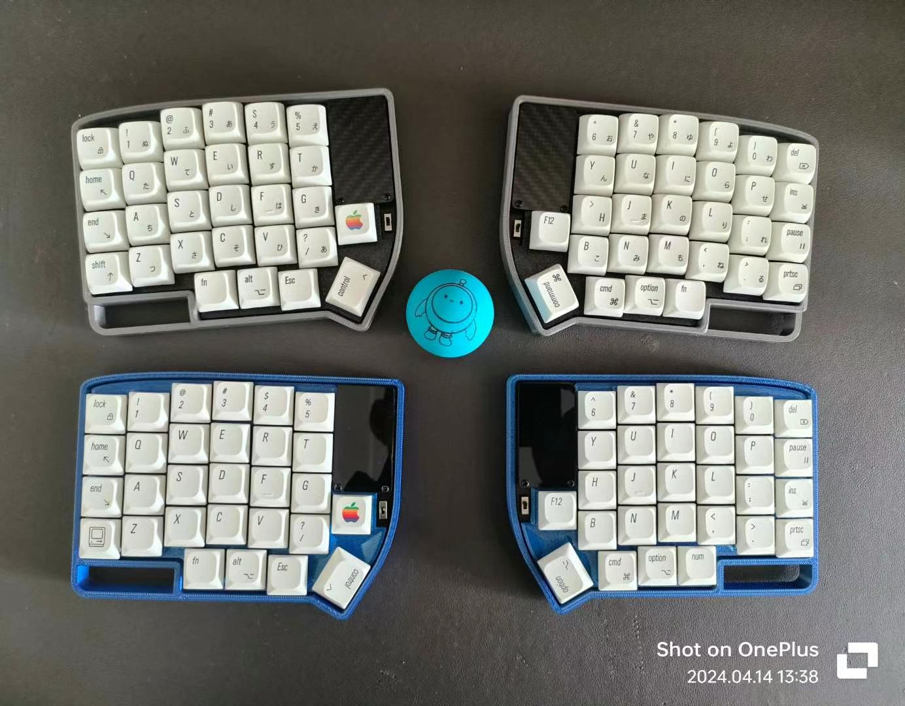

# kbd.guojing.io

This repository contains the source code for [kbd.guojing.io](https://kbd.guojing.io),
a personal keyboard shop built with **Astro** and deployed via **Cloudflare Pages**.



## About

On this site, you can:

- **Purchase keyboards** that I've built and shared (checkout via Stripe).
- Browse documentation for my custom keyboards.
- Read configuration guides (Vial, QMK, layers, macros, battery, etc.).
- View policies (Privacy, Terms of Service, Shipping & Returns).

## Tech Stack

- [Astro](https://astro.build/) — Static site generator (`output: 'static'`)
- [Tailwind CSS v4](https://tailwindcss.com/) — Styling, Geist/Vercel-style design system
- [Geist](https://vercel.com/font) — Typeface
- [Cloudflare Pages](https://pages.cloudflare.com/) — Hosting and deployment
- [Stripe](https://stripe.com/) — Payment integration

## Develop

```sh
npm install
npm run dev      # local dev server
npm run build    # static build to ./dist
npm run preview  # preview the production build
```

## Structure

- `src/content/products/` — one markdown file per keyboard (price, gallery, copy)
- `src/content/pages/` — docs, guides, FAQ, policies, about (path = route)
- `src/components/` — Topbar, Footer, ProductCard, Gallery, DocsSidebar
- `src/layouts/Base.astro` — shared shell + SEO (meta, Open Graph, JSON-LD)
- `src/styles/global.css` — Tailwind v4 theme tokens + component classes
- `public/` — images and static assets

## Deploy

It's a static site (`dist/`). On Cloudflare Pages set **Build command** `npm run build`
and **Output directory** `dist`. The same build also deploys to Vercel as-is.

## Contact

If you have questions about the site or the keyboards:

- 📱 Telegram: [Lily58 KBD](https://t.me/+v8c4mhUeGGk4NWM9)
- 📧 Email: [kbd@guojing.io](mailto:kbd@guojing.io)
- 🐙 GitHub Issues: [jing2uo/lily58-shop](https://github.com/jing2uo/lily58-shop/issues)

---

⚠️ **Note**: This is a personal hobby project, not a company.
Each keyboard is assembled and tested by me before shipping.
