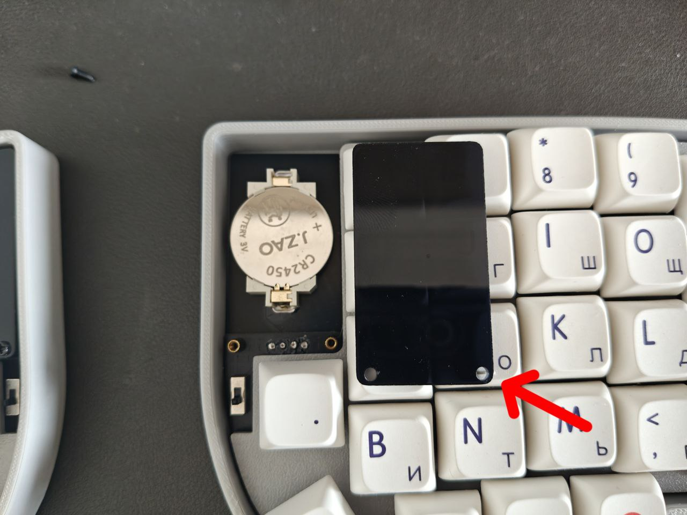

---

If you notice that the keyboard keys become unresponsive after a period of use, first check whether the battery is running low.

To replace the battery:

1. Use a screwdriver to open the black acrylic cover.
2. Beneath it is the location of the coin cell battery. Please replace it with a new **CR2450**.
3. It is recommended to turn off the keyboard switch during this operation to prevent unintended keystrokes from appearing on the screen.

  

Note: When reinstalling the acrylic cover, note that the side where the screw holes have a narrower surrounding edge is closer to the keycaps.
You can identify the correct orientation by flipping the cover.
