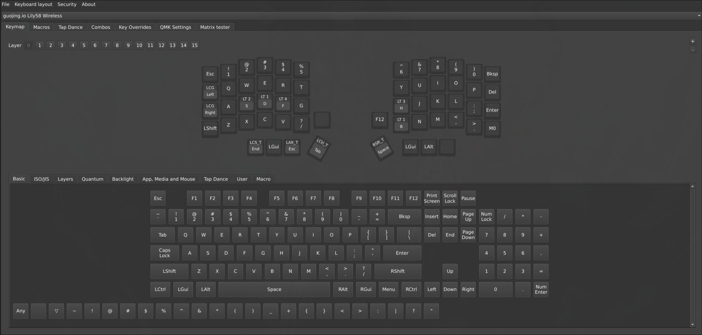

We recommend using the [Vial software](https://get.vial.today/) for full functionality. Access the web version at [vial.rocks](https://vial.rocks) (Chrome required). It provides more features and a better user experience.

  

Here are some simple statements about its capabilities:

### Fully Customizable Keys

- Each key can have different behaviors for:
  - **Tap** (short press)
  - **Hold** (long press)
  - **Tap Dance** (double-tap or multiple taps)

### Macros

- Configure sequences such as phone numbers, ID numbers, or frequently used passwords.
- **Dynamic macros** can be recorded and executed anytime.

### Tap Dance

- Trigger special actions by quickly tapping a key multiple times.
- Can be combined with macros for advanced behaviors.

### Combos

- Press multiple keys simultaneously to produce another key.
- Example: press `J + K` → outputs `L`, press `U + I` → outputs `Enter`.

### AutoShift

- Enable in **QMK Settings**: slightly longer press of numbers `1 2 3 4` outputs `! @ # $`.

### Layers

- Each layer can have different key functions.
- You can assign long presses on `ASDF` or `HJKL` to switch layers.

### Thumb Cluster Optimization

- Place high-use keys under thumbs:
  - `Ctrl`, `Shift`, `Alt`, `Esc`, `Tab`, `Space`, etc.
  - Combine short press / long press for maximum efficiency.

### Compact Layer Layouts

- Configure a small layer for quick numeric input.
- Configure brackets in a layer:
  - `O + P` → `{ }`
  - `L + ;` → `[ ]`
  - Note: `9` and `0` are already brackets.

### Quantum Features

- Map key combinations like `Ctrl + Alt + Delete` to a single key.

### Special Keys

- **GUI**: Windows `Win` or Mac `Command`.
- **LGUI** / **RGUI**: Left and right Win/Command keys (not tied to split halves).
- Other modifier keys (`Shift`, `Ctrl`, etc.) follow similar `Lxxx` convention.

---

For more advanced configuration, see the full [QMK documentation](https://docs.qmk.fm/).
