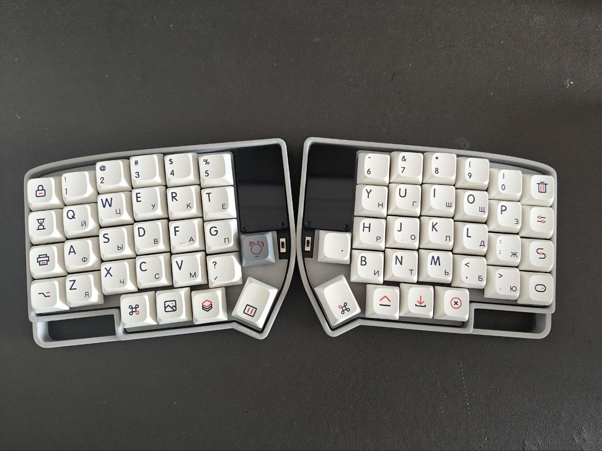

The **Lily58 MX Wireless** brings classic MX mechanical switches to a split ergonomic design.

📌 **Note:** The keycaps shown in the photos are from a unique set I happened to source. Only one set is available, and once it is sold, the product images will be updated accordingly.

  

  

## What You’ll Get 📦

### 🔧 Hardware

- A fully soldered and assembled **Lily58 2.4G wireless split keyboard**
  (two halves + one 2.4G receiver + one Type-C cable to connect the receiver to your computer).
- **58 Kailh Box Red switches** installed.
- **PBT keycaps** included.
- **Two CR2450 coin-cell batteries** (pre-installed under the black acrylic backplate).

### 💻 Firmware

You’ll also get powerful firmware features out of the box:

- **16 Layers** for maximum flexibility
- **36 Macros** to automate your inputs
- **31 Tap Dance actions**
- **31 Combos** for multi-key shortcuts
- **32 Key Overrides** for custom key behaviors
- Support for advanced features like:
  - Magic Key
  - Grave Escape
  - Tap-Hold
  - AutoShift
  - Mouse Keys
  - One Shot Keys

### 📸 Gallery

  

  

  

  

  

  

  

  

